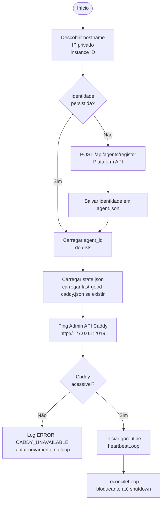
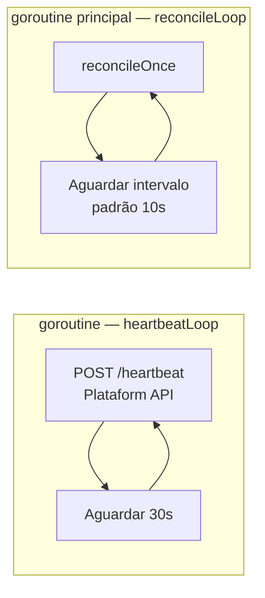
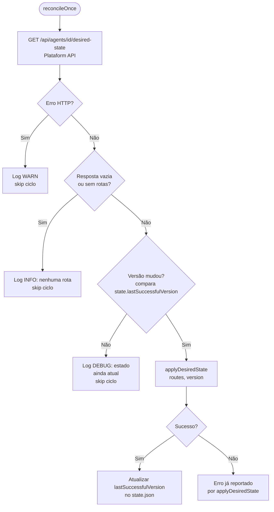
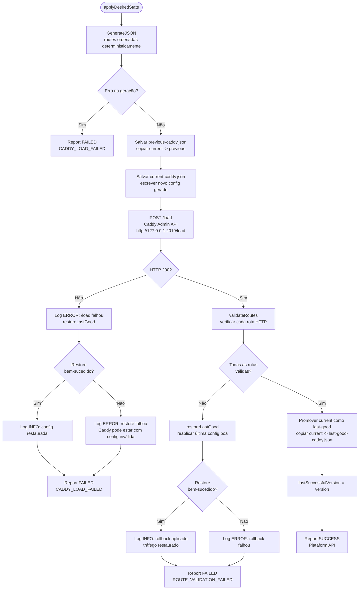
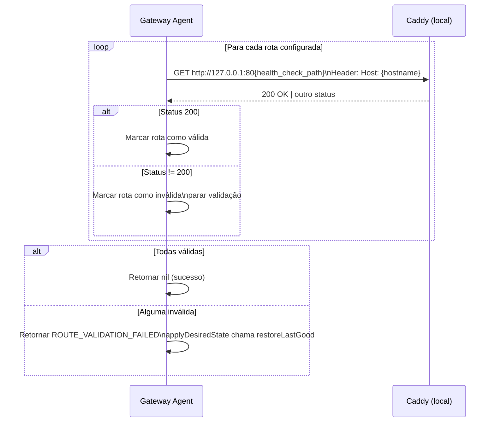
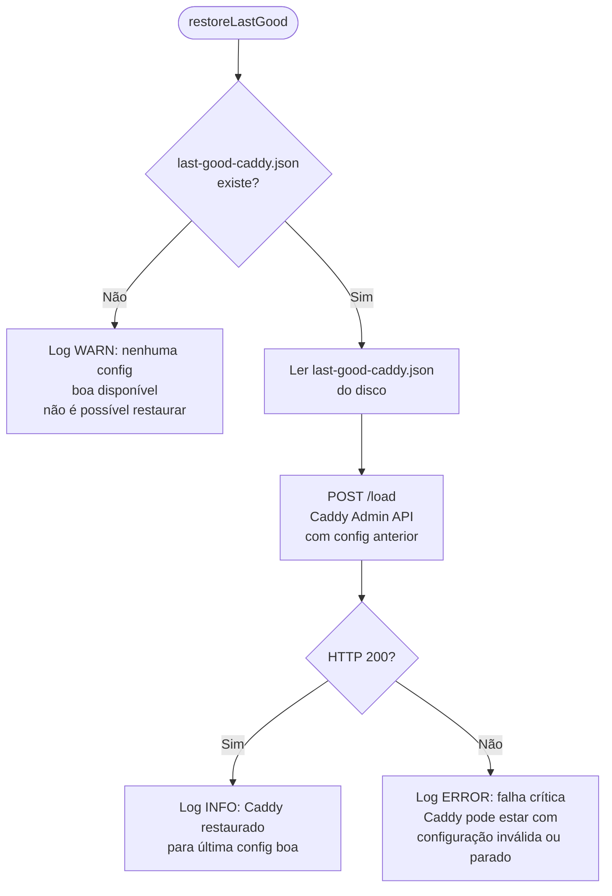
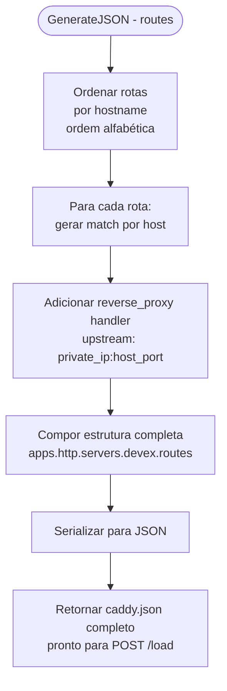
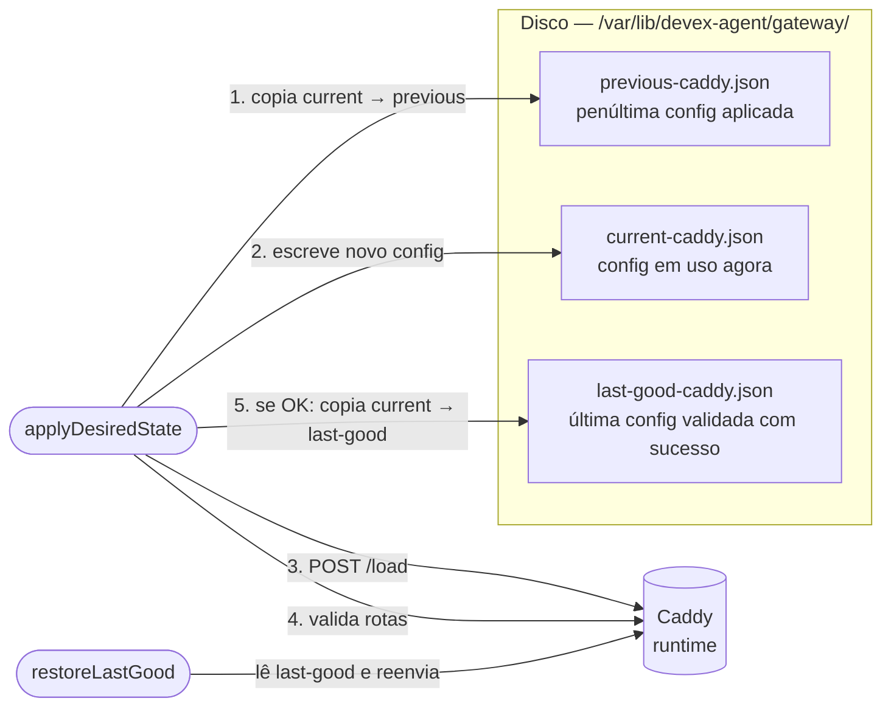
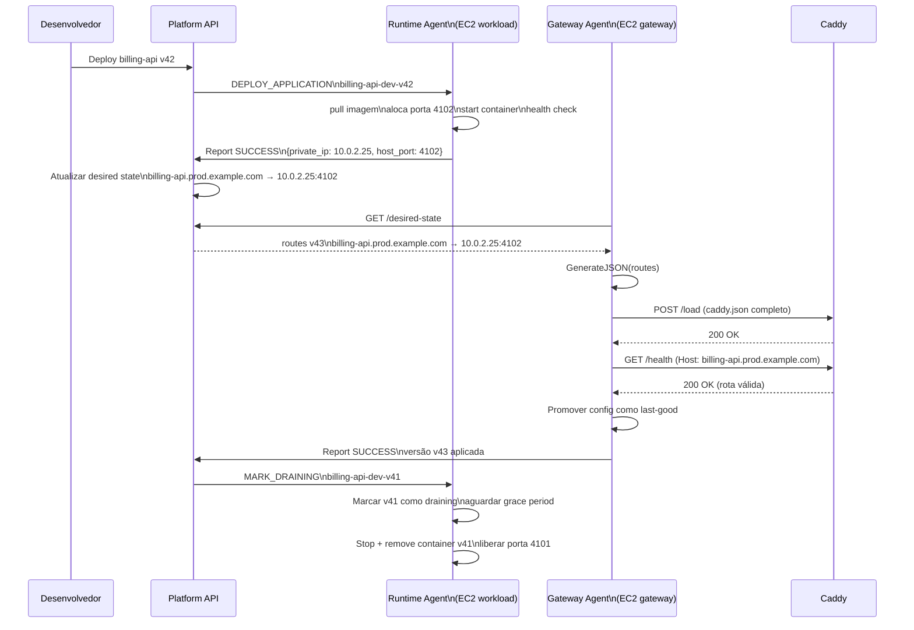

# Gateway Agent — Fluxos de Operação

O Gateway Agent roda em instâncias EC2 responsáveis pelo Caddy Gateway. Ele busca o estado desejado de rotas na Platform API, gera e aplica o `caddy.json` completo, valida as rotas e reporta o resultado. Em caso de falha, restaura a última configuração conhecida como boa.

---

## 1. Sequência de boot



---

## 2. Loops concorrentes

O Gateway Agent tem dois loops. `reconcileLoop` bloqueia a goroutine principal; `heartbeatLoop` roda em goroutine separada.



---

## 3. Loop de reconciliação — reconcileOnce

A cada ciclo, o agente busca o estado desejado da Platform, compara com a versão atual e aplica se houver mudança.



---

## 4. Aplicação do estado desejado — applyDesiredState

Este é o fluxo central do Gateway Agent. Toda atualização de rotas passa por aqui, com pontos de rollback explícitos em cada etapa crítica.



---

## 5. Validação de rotas — validateRoutes

Após cada `/load` bem-sucedido, o agente verifica que o Caddy está realmente servindo as rotas esperadas.



---

## 6. Rollback — restoreLastGood

O rollback é ativado automaticamente quando `/load` falha ou quando a validação de rotas detecta problemas. Ele reaplicar a última configuração que foi validada com sucesso.



---

## 7. Geração do caddy.json — GenerateJSON

O gerador produz sempre o arquivo completo e determinístico. Não há mutações parciais.



Exemplo de rota gerada para `billing-api.prod.example.com → 10.0.2.25:4102`:

```json
{
  "match": [{ "host": ["billing-api.prod.example.com"] }],
  "handle": [{
    "handler": "reverse_proxy",
    "upstreams": [{ "dial": "10.0.2.25:4102" }]
  }]
}
```

---

## 8. Gestão de arquivos de configuração

O Gateway Agent mantém três arquivos de configuração Caddy para suportar rollback:



| Arquivo | Quando é atualizado | Para que serve |
|---|---|---|
| `current-caddy.json` | Toda vez que um novo config é gerado | Referência do que foi enviado ao Caddy |
| `previous-caddy.json` | Antes de sobrescrever o current | Debug e auditoria |
| `last-good-caddy.json` | Somente após validação bem-sucedida | Fonte de rollback |

---

## 9. Fluxo completo — novo deploy de aplicação

Sequência completa desde o deploy de uma nova versão até o Caddy rotear o tráfego, mostrando a interação entre Runtime Agent, Platform e Gateway Agent.



---

## 10. Integração com o Caddy

O Gateway Agent não requer que o Caddy rode em Docker. Ele se comunica exclusivamente pela Admin API HTTP local.

| Aspecto | Detalhe |
|---|---|
| Endpoint Admin API | `http://127.0.0.1:2019` (nunca exposto publicamente) |
| Operação de atualização | `POST /load` com `caddy.json` completo |
| Operação de health | `GET /config/` para ping |
| Validação de rota | `GET http://127.0.0.1:80{path}` com `Host` header |
| Restart do Caddy | Não necessário; `/load` é atômico |
| Rollback | Re-envia `last-good-caddy.json` via `/load` |

A Admin API deve estar configurada para ouvir em `0.0.0.0:2019` (dentro do container Caddy ou do processo), mas o Security Group deve bloquear a porta 2019 para acesso externo. O agente acessa sempre via `127.0.0.1`.
