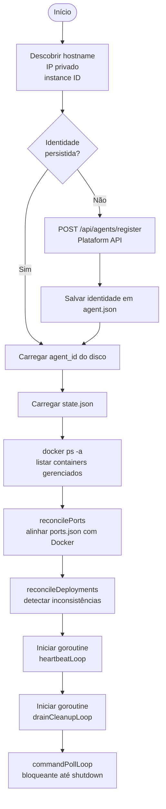
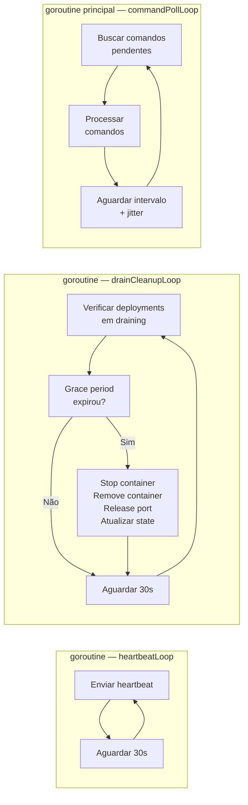
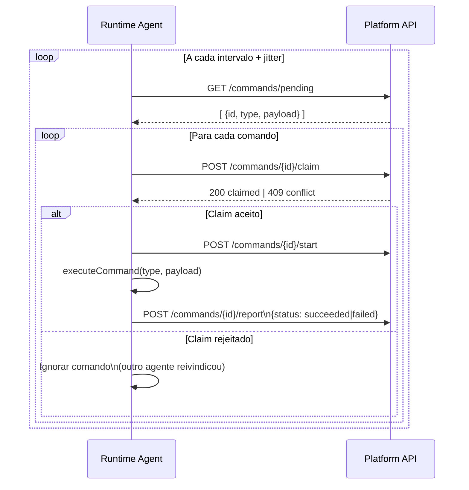
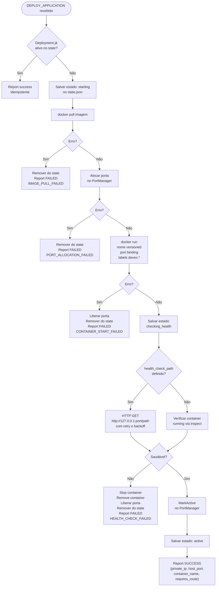
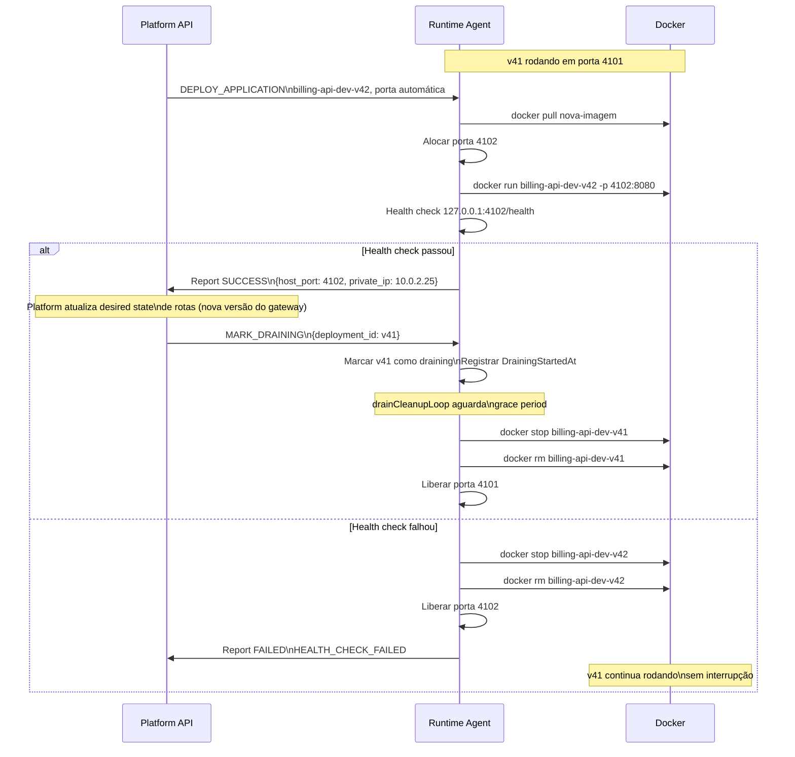
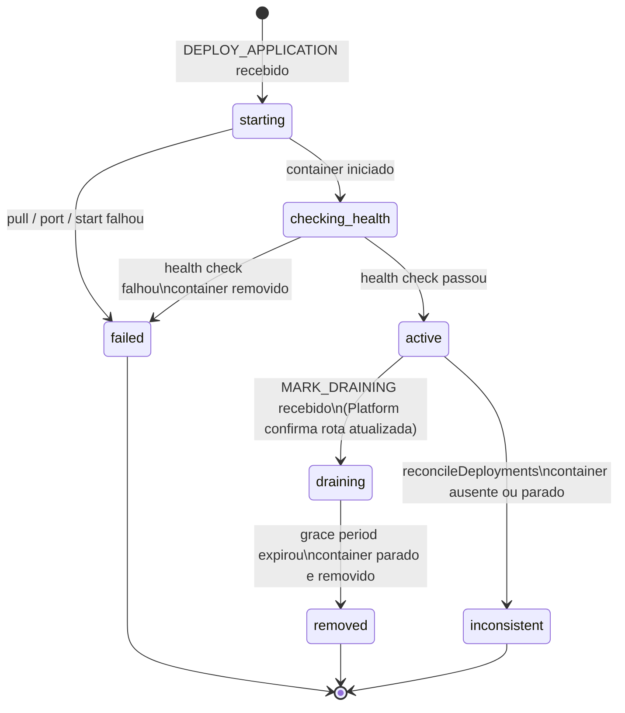
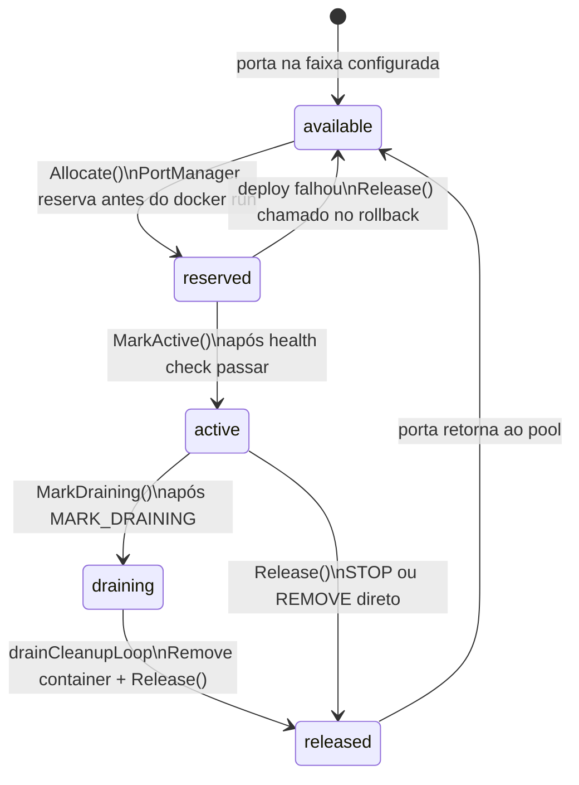
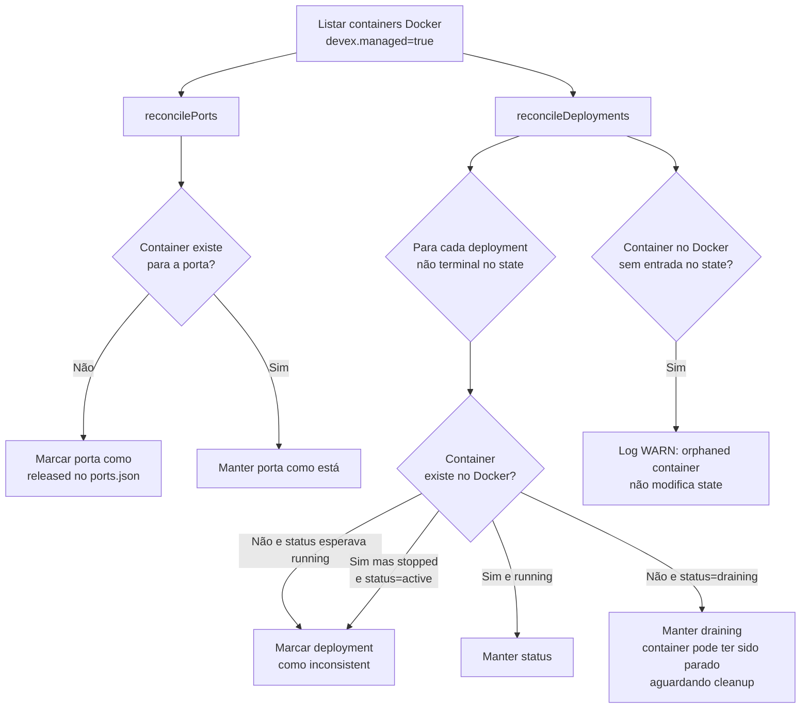

# Runtime Agent — Fluxos de Operação

O Runtime Agent roda em instâncias EC2 responsáveis por executar workloads de aplicação. Ele faz polling na Platform API, reivindica comandos atomicamente, executa operações Docker e reporta resultados.

---

## 1. Sequência de boot

Ao iniciar, o agente descobre as informações do host, garante que está registrado na Platform, carrega o estado local e reconcilia com o Docker antes de entrar nos loops principais.

---

## 2. Loops concorrentes

Após o boot, três loops rodam em paralelo. `commandPollLoop` bloqueia a goroutine principal; os outros dois rodam em goroutines separadas.

---

## 3. Ciclo de processamento de comandos

Para cada ciclo do poll loop, o agente busca, reivindica e executa um comando por vez, garantindo a transição atômica `pending → claimed → running`.

---

## 4. Fluxo de deploy — DEPLOY_APPLICATION

O fluxo de deploy é o mais crítico. Cada etapa tem rollback explícito em caso de falha para garantir que nenhum recurso fique alocado sem container ativo.

---

## 5. Fluxo blue/green local

Quando uma aplicação já tem uma versão rodando e recebe um novo deploy, a versão anterior é mantida até a nova ser validada.

---

## 6. Máquina de estados — Deployment

---

## 7. Máquina de estados — Porta

---

## 8. Reconciliação no startup

Ao iniciar, o agente compara o state.json com os containers reais no Docker para detectar inconsistências ocorridas enquanto o agente estava offline.

---

## 9. Comandos suportados

| Comando | Descrição |
|---|---|
| `DEPLOY_APPLICATION` | Pull + start + health check + report endpoint |
| `STOP_APPLICATION` | Para o container, marca porta como draining |
| `REMOVE_DEPLOYMENT` | Para + remove container, libera porta, limpa state |
| `CLEANUP_DRAINING` | Força limpeza imediata de um deployment em draining |
| `MARK_DRAINING` | Sinaliza que a rota foi atualizada; inicia grace period |
| `RECONCILE` | Força reconciliação de portas, deployments ou ambos |
